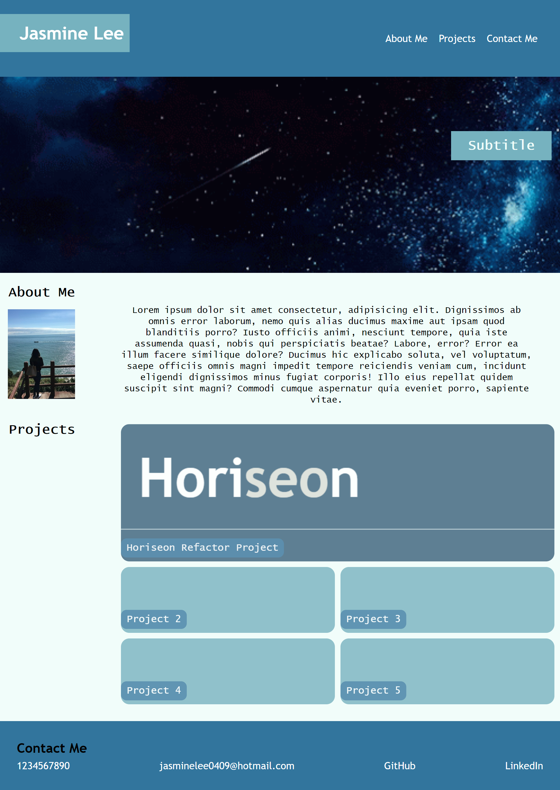

# Jasmine's Portfolio

## Description

This webpage is built to showcase my current work and future projects. This also serves as a resume to demonstrate my skills and abilities to the prospective employers. Note that for now, only one of the items under "Project" has a link to the deployed application; more links to projects to be added as the bootcamp progresses!

## Installation

N/A

## Usage

Reading through this webpage will provide you with a little about me (this is currently random text, to be updated in the future). You can access the topics in the page by using the navigation bar located at the top right of the page. Clicking on the "Horiseon Refactor Project" card in the "Project" section will take you to the deployed application. You will be redirected when clicking the items in the "Contact Me" section. Lastly, right-click anywhere in the browser window and select "Inspect" to open the Developer tools and click on the "Toggle device toolbar"; adjust the screen width to 768px or less to see the changes in layout.

Link to the deployed application: https://jasmineleeyt.github.io/portfolio/

Screenshot of the website:

## Credits

I used w3schools to search up the tags and properties to use: https://www.w3schools.com/

This Youtube video helped me understand how to use css grid (Author: Rachel Andrew): https://www.youtube.com/watch?v=RssSS_xhv2E

This is the source of the star banner that is used on my website (Author: Annaxemilie): www.pinterest.ca/pin/293719206952206779/

## License

Please refer to the LICENSE in the repo.
